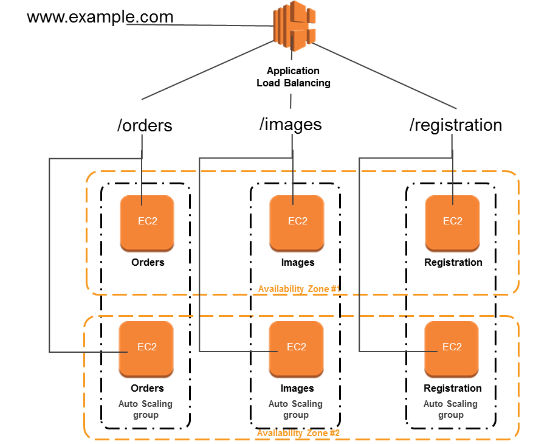

# streamlabs
twitch tv web application

# Server requirement 
PHP >= 7.0.0 
OpenSSL PHP Extension 
PDO PHP Extension 
Mbstring PHP Extension 
Tokenizer PHP Extension 
XML PHP Extension 
MYSQL server 5.5 or above  
Twitch developer account

# Installation guide 
Clone the repo from git@github.com:mohamedrasvi/streamlabs.git  
Run (Composer install)  
Run this command to copy the .env file (cp -i .env.example .env)  
Change your database credentials  and Twitch credentials on .env file  
Run (php artisan migrate) 
You can setup a virtual server or docker or run (php artisan serve
) to see the website on browser

# live demo
Url : http://streamlabs-streamlabs.1d35.starter-us-east-1.openshiftapps.com L
How it work (when you click the url it takes you to sign-in page twitch once successfully signed-in it returns back to our live demo) 
You can add or update streamer 
Home page will show your streamer live streaming, chat with latest top ten videos 
Please note it is hosted on free Openshift server sometime it goes up and down so always refresh if you get any error message,
Have used very simple front-end  

# Architecture diagram deployment and server 
 
Please I have uploaded sample image to show how I will deploy to AWS 
I will containerize  the repository and deploy to many nodes 
I will have a Loadbalance to handle traffic and all (amazon loadbalance does many things)

